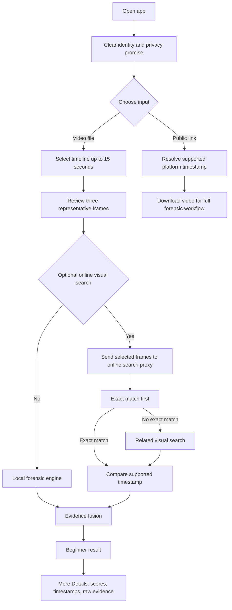
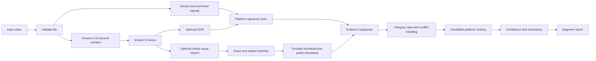
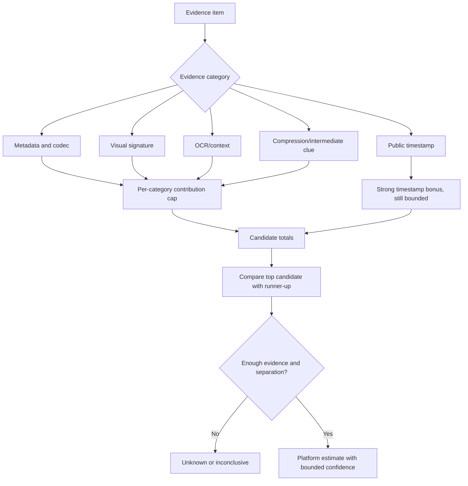
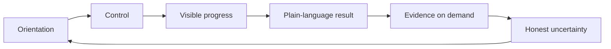
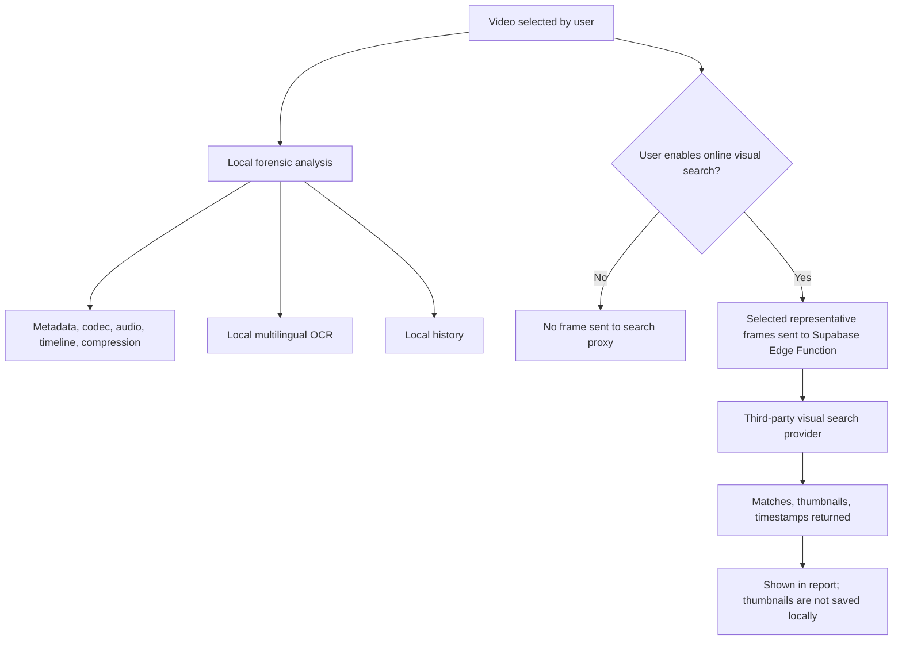
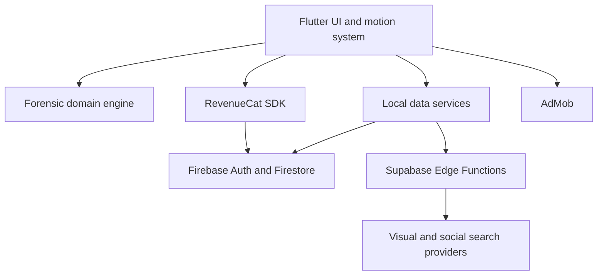
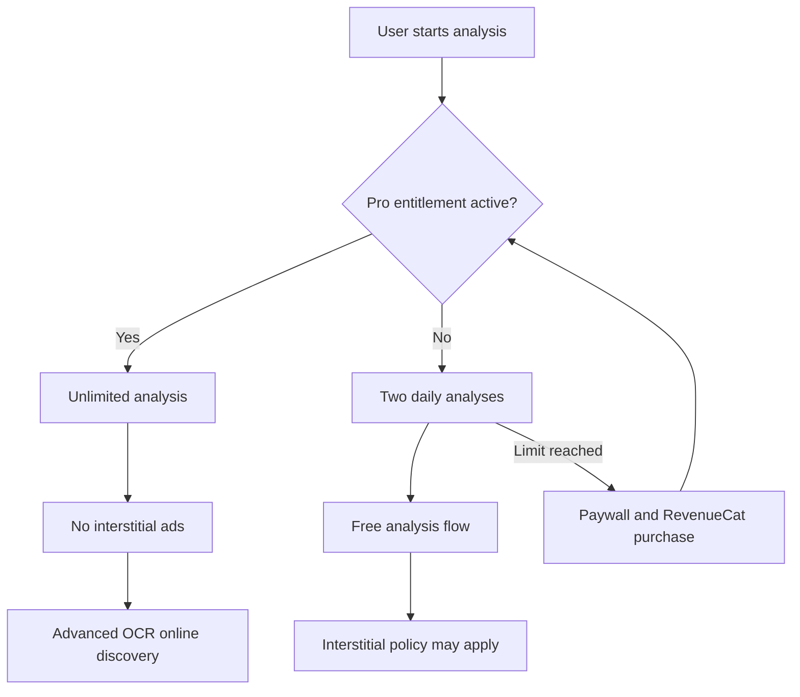

# Video Origin Analyzer

[](https://flutter.dev/)
[](https://firebase.google.com/)
[](https://www.revenuecat.com/)
[](#privacy-and-data-boundary)
[](#release-readiness)

> **Find the earliest evidence. Explain the uncertainty. Never replace evidence with confidence theater.**

Video Origin Analyzer is a privacy-conscious forensic assistant that estimates where a social video most likely originated. It combines local media signals, platform signatures, selected-frame visual search, multilingual OCR, public timestamps, and beginner-friendly evidence reporting.

It is not a magical ownership detector. A repost can be edited, screen-recorded, re-encoded, cropped, or stripped of metadata. The product is designed to make the best available evidence understandable, auditable, and honest about uncertainty.

## Why This Product Matters

When someone sees a video on Instagram, TikTok, WhatsApp, or YouTube, the visible platform is often not the original source. Users need to answer three different questions:

1. **What platform does this copy resemble?**
2. **Which public match is the oldest verified appearance?**
3. **How strong and how limited is that conclusion?**

Most tools answer only the first question and show a confident label. Video Origin Analyzer separates platform clues, public timestamp clues, exact matches, related matches, and repost/intermediate evidence so the user can reason instead of blindly trusting a score.

## Product Promise

| Promise | How the app supports it |
| --- | --- |
| Beginner-friendly | Plain-language result first; technical scoring stays behind More Details |
| Evidence-led | Each conclusion is connected to metadata, codec, visual, OCR, or timestamp evidence |
| Privacy-conscious | Local forensic analysis is the default; only optional online search sends selected frames to the search proxy |
| Honest | Confidence is bounded and the disclaimer explains edited/re-encoded media limits |
| Useful | Supports local files, public video links, long-video segment selection, visual matches, and OCR discovery |

## Core Features

### Forensic Analysis

- Container, codec, resolution, FPS, audio, bitrate, timeline, and compression analysis
- Platform signature comparison for TikTok, Instagram, and YouTube candidates
- Intermediate-channel clues such as WhatsApp-style re-sharing and re-encoding
- Correlated evidence caps so repeated clues do not inflate the result without limit
- Confidence based on evidence volume and separation from the runner-up, not a raw popularity guess

### Visual Search

- Long videos can be narrowed to an analysis window of up to 15 seconds
- Three representative frames are extracted from the selected segment
- Exact matches are preferred over merely related visual results
- If exact matches are unavailable, the normal related-search path is used
- Match details show the provider thumbnail from its direct URL without saving the thumbnail locally
- Public post timestamps are compared when a supported platform timestamp is available

### Link and OCR Workflows

- Public video-link inspection can resolve supported platform timestamps
- Local multilingual OCR supports Latin, Chinese, Devanagari, Japanese, and Korean scripts
- OCR-related online discovery is a Pro capability; local OCR remains available in the free flow
- Users are guided to download a video and run full forensic analysis when a link alone cannot expose enough evidence

### Account, Quota, and Monetization

- Free tier: two daily analyses
- Device continuity uses a hashed device fingerprint and hashed network IP so clearing app storage does not automatically create a fresh quota
- Signed-in users sync usage and entitlement records with their Firebase user ID
- Anonymous users use a device-scoped Firestore record when Firebase anonymous auth is available
- RevenueCat entitlement ID: `pro`
- Pro: unlimited analysis, advanced OCR online discovery, and no interstitial ads
- Ad display is guarded both at the analysis screen and inside the ad service, so an active Pro entitlement cannot show an interstitial

## How the User Experiences the App



## Evidence Pipeline



## Evidence and Scoring Model

The scoring system is a ranking aid, not proof of authorship and not a mathematical probability. It deliberately avoids presenting a perfect-looking number when evidence conflicts.



### What Each Signal Means

| Signal | Strength in reasoning | What it can tell us | What it cannot prove |
| --- | --- | --- | --- |
| Public timestamp | Strong when verified | A public post existed by that time | Who created the content first privately |
| Exact visual match | Strong identity clue | The same visual content likely appeared there | That the matched account is the original creator |
| Related visual result | Discovery clue | Similar or derivative posts to inspect | That the result is the same video |
| Codec/container metadata | Local technical clue | How the current file was encoded or transformed | The original upload platform by itself |
| OCR text | Context clue | Captions, usernames, signs, and search terms | That visible text belongs to the creator |
| Compression trail | Repost clue | Possible intermediate sharing or re-encoding | The complete chain of custody |

## Beginner Psychology and Trust Design

The interface is intentionally designed around user confidence through clarity, not manipulation.

### The Trust Sequence



| Psychology principle | Product implementation | Why it matters |
| --- | --- | --- |
| Reduce cognitive load | One beginner result before raw scores | Users understand the answer before the machinery |
| Preserve agency | Timeline and frame selection for long videos | Users can choose the meaningful segment |
| Create control | Clear privacy and input instructions | Users know what happens before tapping Analyze |
| Reduce uncertainty | Analysis stages and progress feedback | Waiting feels purposeful rather than broken |
| Build earned confidence | Evidence cards and timestamps behind More Details | Confidence comes from inspectable reasons |
| Avoid false certainty | Unknown/inconclusive outcomes and bounded confidence | The app does not overclaim when signals conflict |
| Prevent fatigue | Short, purposeful reveal animations only | Motion guides attention instead of distracting from evidence |
| Respect accessibility | System reduced-motion preference is honored | Users can disable motion without losing functionality |
| Protect the premium promise | Pro state removes limits and ads immediately | A paid user sees a consistent, respectful experience |

### Motion Rules

- No decorative infinite loops on analysis or result screens
- No bouncing or shaking that implies urgency or error without cause
- Entrance reveals are short, staggered, and attached to meaningful content groups
- Analysis-stage changes use a restrained state transition so the user can follow progress
- Reduced-motion settings skip movement while keeping content visible
- Layout uses `SafeArea`, scrollable content, and bounded cards to remain usable on narrow phones and larger screens

## Privacy and Data Boundary

The app has two distinct processing modes and the README makes that difference explicit.



### Stored and Not Stored

| Data | Treatment |
| --- | --- |
| Raw video | Processed locally by the forensic engine; not uploaded by local analysis |
| Selected search frames | Sent only when optional online visual search is used |
| Search thumbnails | Displayed from provider URLs; not downloaded or persisted by the app |
| Raw IP address | Not stored; a hash may be used for quota continuity |
| Raw hardware identifiers | Not stored; a hashed device fingerprint is used for quota continuity |
| Free usage count | Stored locally and synchronized to scoped Firestore records |
| Pro entitlement | Managed by RevenueCat and synchronized to the Firebase account record |
| Server provider keys | Stored as Supabase Edge Function secrets, never in Flutter code |

Firebase client configuration, RevenueCat mobile SDK keys, and AdMob IDs are public client configuration values. They are not substitutes for server secrets. Never commit signing keys, `.env` files, Supabase local state, or provider secrets.

## System Architecture



### Repository Map

| Path | Responsibility |
| --- | --- |
| `lib/domain` | Forensic analyzers, platform signatures, scoring, evidence fusion |
| `lib/data` | Local persistence, frame extraction, OCR, Firebase sync, link resolution, online services |
| `lib/features` | Authentication, home, picker, timeline, progress, report, history, settings, paywall |
| `lib/core/widgets` | Reusable identity and reduced-motion-aware UI primitives |
| `lib/core/theme` | Light/dark Material theme and typography |
| `supabase/functions` | Server-side visual search and social metadata integrations |
| `firestore.rules` | Account/device-scoped quota and entitlement access rules |
| `assets/brand_mark.svg` | Product identity mark: lens, video frames, and evidence trail |
| `.github/workflows/build_apk.yml` | Dependency install, analysis, tests, release APK build, artifact upload |

## Free and Pro Experience



The Pro promise is intentionally simple: more capability, fewer interruptions, and no hidden ad behavior after entitlement activation. RevenueCat remains the source of truth for the active entitlement; Firebase stores a synchronized account record for product continuity and audit context.

## Limitations and Responsible Use

- A public timestamp proves public availability, not necessarily authorship.
- Search providers can return related content, incomplete indexes, stale timestamps, or incorrect platform classifications.
- Cropping, screen recording, editing, watermarks, re-encoding, and metadata removal can reduce accuracy.
- OCR quality depends on language, resolution, contrast, font, and motion blur.
- Network failure or unavailable Supabase functions should degrade to local analysis rather than pretending online verification succeeded.
- The result is an estimate for investigation and research, not a legal chain-of-custody report.

## Local Development

### Requirements

- Flutter stable with Dart SDK `^3.9.2`
- Android Studio and JDK 17 for Android builds
- Firebase Authentication and Firestore configured for project `alteredtools`
- RevenueCat offerings configured with entitlement `pro`
- Supabase Edge Function secrets configured for online search integrations

### Commands

```bash
flutter pub get
flutter analyze
flutter test
flutter build apk --release
```

### Release Readiness

Before a Shipathon or store submission, verify:

- Google sign-in opens only one account chooser and handles cancellation safely
- Anonymous/device quota survives local storage clearing on the same device
- Signed-in usage and Pro entitlement sync to the correct Firebase user ID
- RevenueCat purchase and restore update the UI immediately
- Pro users never see interstitial ads after entitlement is active
- A long video allows selecting a segment of up to 15 seconds
- Three frames come from the selected segment, not the original unselected timeline
- Exact visual matches are checked before related matches
- Match details show the provider thumbnail URL without saving the thumbnail
- Link inspection provides a timestamp or clearly explains why it cannot
- `flutter analyze`, `flutter test`, and release APK build pass in GitHub Actions

## License

Private project. All rights reserved by Mahad and Mehdi Developers.
