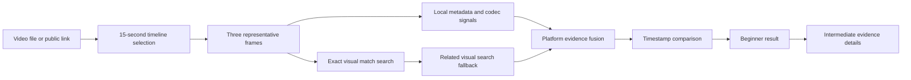
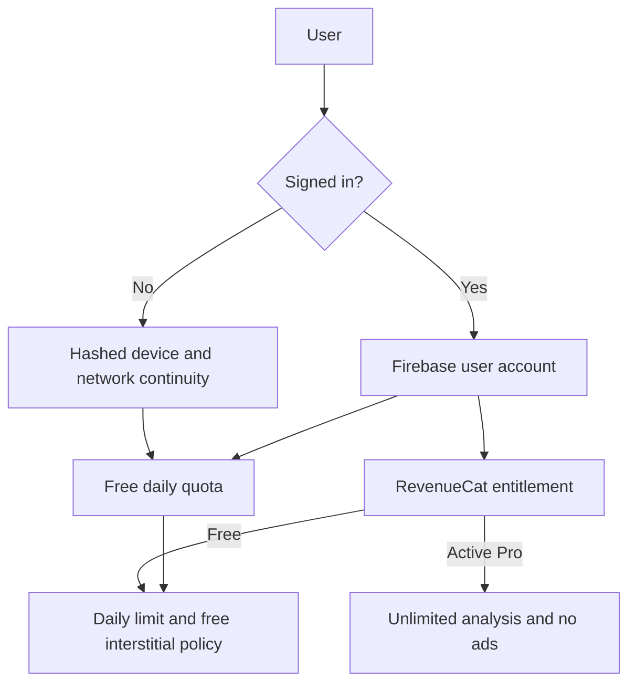

# Video Origin Analyzer

[](https://flutter.dev/)
[](https://firebase.google.com/)
[](https://www.revenuecat.com/)
[](#privacy-and-configuration)

Video Origin Analyzer is a privacy-first forensic assistant for investigating where a social video most likely originated. It combines local media signals, platform signatures, selected-frame visual search, OCR, timestamps, and transparent evidence reporting instead of presenting an unexplained guess.

## Product Goal

Help journalists, researchers, moderators, and everyday users distinguish an original upload from a repost or intermediate compression channel. The app is designed for the RevenueCat Shipathon and uses RevenueCat to gate advanced capabilities through a Pro entitlement.

## Current Capabilities

- Local video metadata, container, codec, audio, timeline, compression, and visual-evidence analysis
- Beginner-friendly result screen with progressive details and hidden scoring until requested
- Timeline selection for long videos, limited to a 15-second analysis window
- Three representative frames extracted from the selected video segment
- Exact-match-first visual search, followed by normal related-content search
- Direct video-link inspection with platform timestamp resolution when supported
- Multilingual on-device OCR for Latin, Chinese, Devanagari, Japanese, and Korean scripts
- Pro-gated OCR-related online search while local OCR remains available in the free flow
- Device-aware free quota recovery using hashed device/network identifiers in Firestore
- Firebase account sync for authenticated users and anonymous device-based continuity
- RevenueCat purchase, restore, entitlement sync, and Firebase Pro-account record
- AdMob interstitials for free users only; Pro users are explicitly excluded from ad display
- Local history and privacy-focused processing; videos and thumbnails are not uploaded by the forensic engine

## Architecture

- `lib/domain`: forensic analysis and scoring logic
- `lib/data`: local persistence, Firebase sync, OCR, frame extraction, link resolution, and online services
- `lib/features`: Flutter presentation, authentication, analysis flow, history, settings, and subscription UI
- `supabase/functions`: server-side visual search and social metadata integrations; provider secrets stay in Supabase secrets
- `firestore.rules`: owner/device-scoped quota and subscription access rules
- `assets/brand_mark.svg`: reusable forensic lens and video-frame brand mark

### Evidence Pipeline



### Trust and Monetization Flow



### Decision Signals

| Signal | Role | User-facing value |
| --- | --- | --- |
| Public timestamp | Earliest verified upload clue | Explains why a platform is considered older |
| Exact visual match | Strong identity evidence | Separates the same video from merely similar posts |
| Metadata and codec | Local forensic evidence | Works without uploading the original video |
| OCR text | Context and discovery signal | Finds related posts in multiple scripts |
| Compression trail | Repost/intermediate clue | Clarifies why the current copy may not be original |

### Quality Targets

| Area | Target behavior |
| --- | --- |
| Clarity | Beginner result first; scoring and raw evidence behind More Details |
| Motion | Short, purposeful transitions with reduced-motion support |
| Privacy | Raw videos, thumbnails, IPs, and hardware IDs are not persisted |
| Monetization | Pro entitlement removes analysis limits and ad display |
| Reliability | Exact-match-first search with timestamp cross-checking and fallbacks |

## Privacy and Configuration

Firebase `google-services.json`, Firebase platform options, RevenueCat mobile SDK keys, and AdMob application/unit IDs are client configuration values intended for mobile distribution. They do not replace server secrets. Supabase provider keys such as SerpApi, YouTube, and social crawler credentials must remain Edge Function secrets and must never be placed in Flutter code.

Raw IP addresses, raw hardware identifiers, videos, and thumbnails are not stored by the quota sync service. Device and network identifiers are hashed before Firestore persistence.

## Local Setup

Requirements:

- Flutter stable with Dart SDK `^3.9.2`
- Android Studio/JDK 17 for Android builds
- Firebase project configured for Authentication, Firestore, and the Android package ID
- RevenueCat offerings configured with the entitlement ID in `lib/core/config/revenuecat_config.dart`
- Supabase Edge Function secrets configured for online search integrations

Commands:

```bash
flutter pub get
flutter analyze
flutter test
flutter build apk --release
```

## Release Checklist

Before submission or store release, verify Google sign-in on a physical device, quota recovery after clearing local storage, RevenueCat purchase/restore, Pro ad suppression, visual-search result thumbnails, long-video segment selection, and a clean release APK build. Do not commit signing keys, `key.properties`, `.env` files, build output, or Supabase local state.

## License

Private project. All rights reserved by Mahad and Mehdi Developers.
